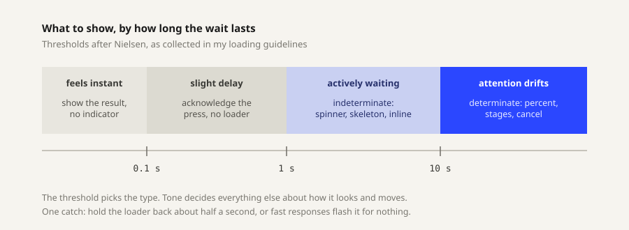

## Research

I started with loading as a topic rather than with sketches, because the split between determinate and indeterminate is not a style choice. It is a claim about what the system actually knows.

### The wait decides the type

Nielsen's thresholds still set the terms, and they map cleanly onto what to show. Under 0.1 seconds the action feels like direct causation, so show the result and nothing else. Between 0.1 and 1 second the delay registers but the train of thought holds, so acknowledge the press with a button state and skip the loader. Past 1 second a real loading state is owed. Past 10 seconds attention drifts, and the indicator has to become measurable: percent, stages, an estimate, and a way out.

The catch is that crossing 1 second is not a cue to appear immediately. Hold the indicator back roughly half a second, because flashing a spinner at something that finishes quickly makes the interface feel slower, not faster. An indicator's first job is knowing when not to show up.

### What the two words commit to

Material's definitions are useful because they are strict. Indeterminate means the process is running and the wait is unknown. Determinate means the indicator must accurately represent what it measures, which rules out a bar that moves for reassurance rather than for information. The rule worth stealing is the transition: as progress becomes knowable, an indicator should move from indeterminate to determinate rather than stay vague.

Two smaller conventions. Linear indicators run leading edge to trailing edge and circular ones start at the top going clockwise, so breaking that reads as a bug rather than as style. And Material adds a small stop indicator at the end of a determinate track when contrast against the surface falls under 3 to 1, a reminder that a quiet tone still has an accessibility floor.

### Waiting is felt, not measured

This is the part the tones get to work on.

Harrison, Yeo and Hudson tested visual augmentations on progress bars. Ribbing that moves backwards while decelerating cut perceived duration by about 11 percent with no change to actual duration.

Ziat and colleagues went further in 2022, holding speed and distance constant and varying only how progress was divided. More steps, each smaller, read as faster and compressed perceived time. Fewer, larger steps dilated it. Their conclusion is that perceived time depends on the nature of the stimulus, not on the speed or distance of the motion.

So step granularity is a tone control, not a technical detail. A calm tone can afford coarse steps. An urgent one probably wants fine ones.

Skeleton screens are the other well-known move. A skeleton describes the shape of what is arriving, so the wait becomes a preview. A spinner does the opposite and puts a focal point on the delay itself. The often-quoted claim that skeletons feel 30 percent faster traces back to blog posts rather than a controlled study, so I am treating the direction as credible and the number as unsupported.

### Rules the tone has to survive

These came out of the guidelines as hard requirements, not preferences. A tone that cannot survive them is the wrong tone.

- **Keep moving.** A frozen loader reads as a frozen app, which is worse than a slow one.
- **Stay proportional.** A small update gets a small indicator. Only long work earns detailed progress.
- **Speak plainly.** "Saving changes" rather than "API request pending". Status text is part of the design.
- **Offer a way out.** Long uploads and exports should allow cancelling when that is safe to do.
- **Do not block what need not be blocked.** If work can continue in the background, let it, and report back when it finishes.

### Function includes being usable

Since the designs have to perform their function, accessibility is part of the work rather than a finishing pass.

A determinate indicator takes `role="progressbar"` with a live `aria-valuenow`. An indeterminate one uses the same role and omits `aria-valuenow`, which is how "unknown" gets expressed to a screen reader. The moving graphic itself should be hidden from assistive tech, with status carried in a text label such as "uploading, 50 percent". Status cannot rest on motion or color alone. Under `prefers-reduced-motion` a looping animation has to park in a sensible resting state rather than simply disappear.

### Pattern survey

Before designing anything, I put the existing vocabulary on one shared clock so the same real duration could be compared across patterns. The duration buttons sit on the thresholds above, and the step control tests the Ziat finding directly.

The last group separates two things the guidelines list side by side. A spinner and a skeleton are different forms. A button state and an inline state are the same forms placed somewhere specific, which turns out to matter more than the form does.

<Demo height="965px" />

What I notice running it at 10 seconds: the numeric readout is the most precise and the least bearable, because there is nothing to watch between updates. The segmented bar at 20 steps feels quicker than the smooth bar over an identical duration, which is the effect the study predicts. The spinner is the only one that tells you nothing except that you are waiting.

### What I am taking into the designs

- The determinate and indeterminate halves of a set should share a tone, not a shape. Shrinking a progress bar into a circle is not the same indicator.
- Step granularity, easing, and direction are where tone lives. They are also measurable, so critique can argue with them.
- Each set needs a named context. An indicator has no tone without something to be the tone of, and the context decides whether cancelling, backgrounding, or status text is even relevant.
- Every design needs a delay before it appears, so all six are aimed at waits past a second.
- Status text belongs in the design, not next to it. Three tones should produce three different sentences.

### Sources

- Loading in Web and Mobile Interfaces, my compiled guide, drawing on Nielsen Norman Group, Apple Human Interface Guidelines and Material Design
- [Response Time Limits](https://www.nngroup.com/articles/response-times-3-important-limits/), Jakob Nielsen, NN/g
- [Progress Indicators Make a Slow System Less Insufferable](https://www.nngroup.com/articles/progress-indicators/), NN/g
- [Progress indicators](https://m3.material.io/components/progress-indicators/guidelines), Material Design 3
- [Faster Progress Bars: Manipulating Perceived Duration with Visual Augmentations](https://www.chrisharrison.net/projects/progressbars2/ProgressBarsHarrison.pdf), Harrison, Yeo and Hudson, CHI 2010
- [Malleability of time through progress bars and throbbers](https://pmc.ncbi.nlm.nih.gov/articles/PMC9213475), Ziat, Saoud, Prychitko, Servos and Grondin, Scientific Reports, 2022
- [ARIA progressbar role](https://developer.mozilla.org/en-US/docs/Web/Accessibility/ARIA/Reference/Roles/progressbar_role), MDN

## Process

Next: three tones, named with their contexts, then sketches in Figma before any code.

Sketches and iteration notes go here. Images belong in this week's `images/` folder.

## Result

The six indicators are not designed yet. This section gets the three sets, each with its determinate and indeterminate pair, once the drawings and prototypes exist.

## Critique

Feedback from class goes here.
