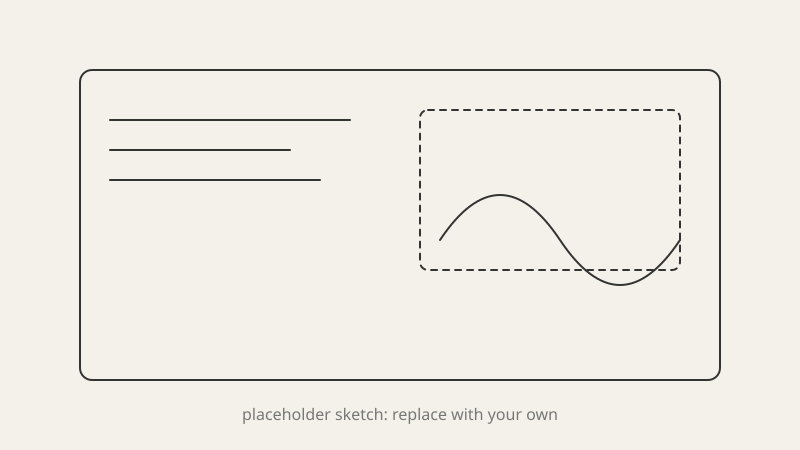
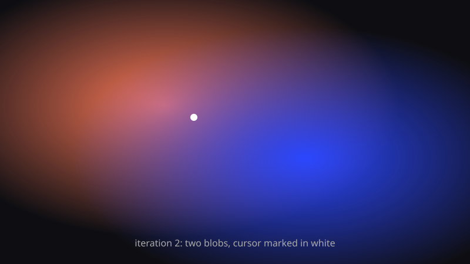

## Process

The goal for week one was mostly to test the workflow: prompt an experiment into existence, drop the process notes here, and get the whole thing on a shareable URL before class.

The experiment itself is a background that reacts to the cursor. A few soft color blobs drift on their own, but lean toward wherever the pointer is.

**Iteration 1.** A single blob following the cursor exactly. It felt like a flashlight, not a field. Too literal.

**Iteration 2.** Three blobs with different weights and a slow idle drift. Each one eases toward the pointer at a different speed, so the field lags and settles instead of snapping.

**Iteration 3.** Added `mix-blend-mode: screen` and a heavy blur. The overlaps now produce a third color, which is what made it feel like one surface rather than three circles.

## Result

<Demo />

Move the pointer around. On touch devices, drag. The blobs keep drifting when idle so the page never looks frozen in a screenshot.

What I would push next: tie the blob colors to time of day, or let a click "pin" one blob in place.

## Critique

Feedback from class:

- Add notes here after critique.
